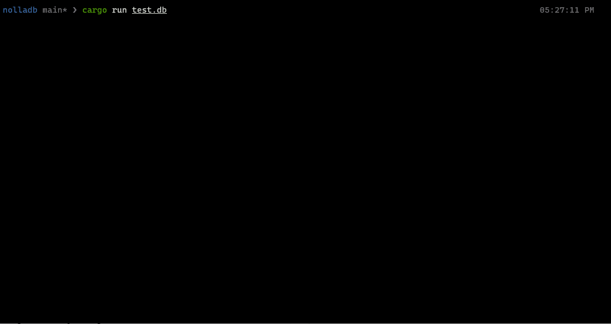

# nolladb

nolladb 是一个基于 Rust 开发的 simple 关系型数据库

用 Rust 之前，为了理解 Rust 的一些核心概念，我写了一篇博客

[Rust所有权、生命周期、内存管理](https://strugglebak.github.io/2022/06/06/Rust%E6%89%80%E6%9C%89%E6%9D%83%E3%80%81%E7%94%9F%E5%91%BD%E5%91%A8%E6%9C%9F%E3%80%81%E5%86%85%E5%AD%98%E7%AE%A1%E7%90%86/)

在写这个数据库时，为了充分理解 B-Tree 这个数据结构，我还写了一篇关于这个的博客

[B-Tree的Rust实现及其原理](https://strugglebak.github.io/2022/06/06/B-Tree%E7%9A%84Rust%E5%AE%9E%E7%8E%B0%E5%8F%8A%E5%85%B6%E5%8E%9F%E7%90%86)

另外，为了学习数据库的原理，我还去看了那个著名的数据库课程 CMU 15-445/645，并做了几篇对应的笔记，见


[CMU 15-445/645 数据库导论笔记](https://strugglebak.github.io/categories/Database/)

目前来说笔记还未更新完，后续会接着更新


## 运行



## 核心思路

### 整体数据流

如下图所示


### Table

对于 `Table` 来讲，它的结构主要分 5 个

1. `table_rows`

  `table_rows` 是由 `Rc` 和 `RefCell` 指针管理的一个 `HashMap`

  如图所示

  

  这个 `HashMap` 由 2 部分组成，左边的是 `key`，右边的是 `value`

  这里的 `key` 存放的是 `column` 的名称，即字符串

  这里的 `value` 存放的是一个 `BTreeMap`，`BTreeMap` 节点也由 2 部分组成

  - `BTreeMap` 的 `key` 存放 `row_id`
  - `BTreeMap` 的 `value` 存放 `name` 对应的具体的值，也就是字符串

  对于 `table_rows` 的 `key` 来说，每个 `key` 可以有不同的类型，本项目中存在 4 种

  `Integer` / `Bool` / `Text` / `Real`

  在上图中，`name` 对应的 type 是 `Text`，所以在其对应的 `BTreeMap` 中，`value` 存的值就是 `string` 也就是字符串

  为什么要用到 `HashMap`，是因为在针对某一个 `column` 进行操作的场合很方便

  当然 `table_rows` 在本项目中还是整体作为 *数据备份* 使用

2. `table_columns`

  `table_columns` 是一个数组，这个数组里面每个元素都存放着有关 `column` 的信息，比如 `column` 的名称，`column` 的 `datatype`，以及一些约束等等，最重要的 1 项还是它里面的 `index` 索引，这个索引指向的也是一个 `BTreeMap`

  如图所示

  

  可以看到对比于 `table_columns` 里面的 `BTreeMap` 来说，这里面的 `BTreeMap` 的 `key` 和 `value` 是 **反着** 存的

  为什么要用到数组，是因为在一些要查询 `column` 元数据的场合很方便，并且也有利于遍历查询


3. `indexes` 即表索引，也是一个 `HashMap`
4. `table_name` 即表名
5. `primary_key` 即主键
6. `most_recent_row_id`，对应于每一条记录的 `row_id`

### 如何 Create Table

对于创建表的 SQL 语句来说，首先需要解析这条语句成 ast，然后拿到其中的 *表名*、*需要创建的 `column`*

对于 `column` 来说，有几个条件是需要做确认的

1. `Bool` 和 `Real` 类型不能拿来做主键
2. 表里面不能有重复的主键，最多只能有 1 个
3. 如果某个 `column` 不是主键，那么它的约束默认就是 `unique` 和 `not null`

对于创建表来说，它总体也要经过如下的步骤

1. 需要检查表是否已经被创建过了，这个需要到 `Database` 里面找
2. 创建表，初始化一些基本的信息
3. 把表插入到 `Database` 中

### 如何 insert 数据

对于 `INSERT` 这个 SQL 语句来说，首先需要解析这条语句成 ast，然后拿到其中的 *表名*、*`column` 相关的名称* 以及 *`column` 相关的值*

然后 `INSERT` 需要经过如下步骤

1. 首先需要确认的是有没有主键
  - 有主键的话，需要查看要 `INSERT` 的列的列名包不包含主键
  - 如果包含，直接找到这一列更新 `row_id`
  - 如果不包含，那就直接插入这一列的数据，不用更新 `row_id`
2. 还需要检查 `INSERT` 的 `VALUES` 中，还有没有 `column` 的值是没有被设置的，如果有那么这些没有被设置的 `column` 的值，将其默认置为 `null`，然后对这条记录做更新
3. 记录插入完成，随即更新 `row_id`
### Database Manager

对于 `Table` 数据来说，它的整个信息都保存在 `Database` 里，对于 `Database`，它的结构是这样的

```rs
pub struct Database {
  pub database_name: String,
  pub tables: HashMap<String, Table>,
}
```

`Database` 通过 `HashMap` 来管理多个 `Table`

那么谁来管理整个 `Database` 呢? 就是 `DatabaseManager`，它的结构如下

```rs
pub struct DatabaseManager {
  pub database: HashMap<String, Database>,
}
```

它也是通过 `HashMap` 来管理 `Database`，主要的作用就是 *保存* 和 *读取* `Database` 对应的 `.db` 文件的信息，然后将它加载进内存中，然后 `Database` 就可以获取到这些信息，那么在当前 Session 里面就可以对对应的 `Table` 进行操作了

对于 `DatabaseManager` 来讲，每次做完保存操作，都会去更新对应的 `.dmf` 文件，读取时就从这个文件里面读取保存的 `database` 相关的信息，然后加载进内存

*保存* 和 *读取* 都是操作二进制流

## 技术栈

主要是

- `sqlparser 0.13`
- `rstest 0.12`
- `rustyline 9.1.2`
- `prettytable-rs 0.8`
- `bincode 1.3.3`
- `thiserror 1.0.30`

## Features

- [x] 支持命令行接口
- [x] 支持部分 `meta` 命令和 SQL 语句的解析
- [x] 支持 `执行` 简单的命令
- [x] 使用 `thiserror` 支持标准错误处理
- [x] 支持创建 `Table`
- [x] 支持创建 `Table` 时解析重复列
- [x] 支持创建 `Table` 时解析多个 `PRIMARY KEY`
- [x] 支持简单 `INSERT` 查询命令的解析
- [x] 拥有专门为 `PRIMARY KEY` 初始化的内存型 `BTreeMap` 索引
- [x] 支持唯一 `KEY` 约束

## 安装以及调试

```bash
git clone git@github.com:strugglebak/nolladb.git
cd nolladb
cargo run test.db
```

## 测试

```bash
cd nolladb
cargo test
```

## Roadmaps

- [ ] 实现简单 `SELECT` 查询
- [ ] 实现 JOINS
  - [ ] INNER JOIN
  - [ ] LEFT OUTER JOIN
  - [ ] CROSS JOIN
- [ ] 实现预写日志
- [ ] 实现页模块
  - [ ] 实现事务 ACID
  - [ ] 并发
  - [ ] 锁管理
- [ ] 实现复合索引
- [ ] 实现连接管理
- [ ] 实现不同场景下的存储引擎
  - [ ] 实现 `LSM Tree && Sorted Strings Table` 应对大量写的场景
  - [ ] 实现更快的 `B-Tree` 应对大量读的场景

## 踩坑

由于 `Rust` 的 `lifetime` 的原因，抽代码不太好抽，一个建议是能不用引用的地方尽量不用引用，有引用的地方代码就需要考虑 `lifetime` 了


目前来说并没有实现 `SELECT` 和 `UPDATE` 对应的功能，主要还是因为对于 `SELECT` 这种 Query 来讲，它的组合方式有很多，组合的条件也有很多，虽然能用库解析成 ast，但是中间需要考虑的条件有很多种，对于 `SELECT` 来讲它大体需要经过如下几个步骤

1. Logical Plan
2. 针对 Logical Plan 的优化
3. Physical Plan

其中 Logical Plan 用的比较多的方式是用 `Vocanlo Model`，但由于时间有限所以没有继续写下去了

后面会参考下 [databend](https://github.com/datafuselabs/databend) 这个里面有关 SQL Plan 的代码写一版出来，顺便分析下它的代码是怎么写的，可能后面会更一篇文章

## 协议

[MIT](./LICENSE)
